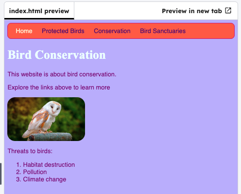

## Choose colours with hex codes

Use a hex colour code to change the website background colour.

## Step 1

Click on the **Project files** tab and open `styles.css`.

## Step 2

Replace the `background-color` with a hex code.

> [!TIP]
>
> Try out [this colour picker](http://dojo.soy/se-html2-picker){:target="_blank"} to choose a colour and find its hex code.

```css filename="styles.css" line_numbers="true" line_number_start="1" line_highlights="2"
body {
  background-color: #c1b6ff; 
  font-family: "Helvetica", sans-serif;
  color: purple;
}
```

## Now run your code

Click **Run** and check that the background colour changes.


