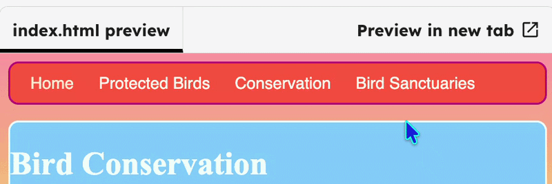

## Challenge: glowing links

Create a “glowing link” style and apply it to links on your website.

## Step 1

Add `class="niceLinks"` to any link on your site. It needs to be inside the `<a>` tag. The example below shows the class added to `index.html`.

```html filename="index.html" line_numbers="true" line_number_start="13" line_highlights="14-16"
    <li>Home</li>
        <li><a class="niceLinks" href="birds.html">Protected Birds</a></li>
        <li><a class="niceLinks" href="conservation.html">Conservation</a></li>
        <li><a class="niceLinks" href="sanctuaries.html">Bird Sanctuaries</a></li>
    </ul>
```

## Step 2

Add a `.niceLinks` class in `styles.css`.

```css filename="styles.css" line_numbers="true" line_number_start="83" line_highlights="88-95"
  to {
    width: 300px;
  }
}

.niceLinks { 
  text-decoration: none;
  color: #FFFAF0;
}

.niceLinks:hover { 
  color: #00FF7F;
}
```

## Now run your code

Click **Run** and check that the links change colour when you hover over them.


