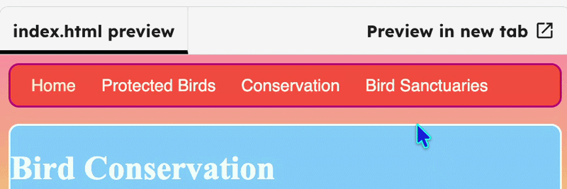

<h2 class="c-project-heading--task">Challenge: glowing links</h2>

--- task ---

Create a “glowing link” style and apply it to links on your website.

--- /task ---

--- task ---

Add `class="niceLinks"` to any link on your site. It will need to be inside `<a>`. Below shows the class added to `index.html`.

--- /task ---

--- code ---
---
language: html
filename: index.html
line_numbers: true
line_number_start: 13
line_highlights: 14-16
---
<li>Home</li>
<li><a class="niceLinks" href="birds.html">Protected Birds</a></li>
<li><a class="niceLinks" href="conservation.html">Conservation</a></li>
<li><a class="niceLinks" href="sanctuaries.html">Bird Sanctuaries</a></li>
</ul>
--- /code ---

--- task ---

Add a `.niceLinks` class in `styles.css`.

--- /task ---

--- code ---
---
language: css
filename: styles.css
line_numbers: true
line_number_start: 83
line_highlights: 88-95
---
  to {
    width: 300px;
  }
}

.niceLinks { 
  text-decoration: none;
  color: #FFFAF0;
}

.niceLinks:hover { 
  color: #00FF7F;
}
--- /code ---

--- task ---

Click **Run** to see your links should change colour when you hover over them.

--- /task ---

