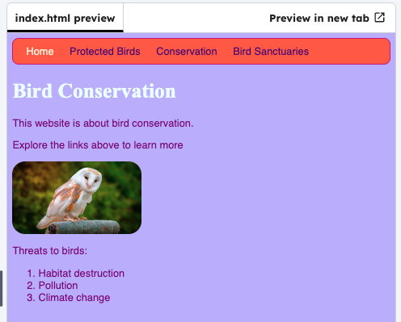

<h2 class="c-project-heading--task">Control an image with CSS</h2>

--- task ---
Make the image size respond to the browser window using a percentage width.
--- /task ---

--- task ---
In `styles.css`, add a `#owly` rule that sets its width to `50%`.
--- /task ---

--- code ---
---
language: css
filename: styles.css
line_numbers: true
line_number_start: 67
line_highlights: 73, 74, 75, 76, 77, 78
---
#myCoolText {
  color: #003366;
  border: 2px ridge #ccffff;
  padding: 15px;
  text-align: center;
  background-color: #660066;
}

#owly { /* new: responsive image size */
  width: 50%;
  border-radius: 100%;
}

img {
  border-radius: 20px;
}
--- /code ---

Resize your browser window: the barn owl image should grow and shrink with the page.

--- task ---
### Test
Resize the browser window and confirm the image changes size.
--- /task ---

--- task ---

Click **Run** to see the background colour change.

--- /task ---

