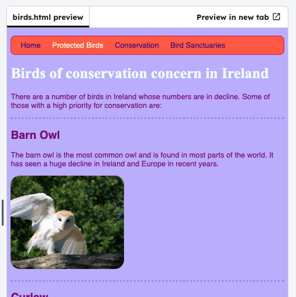

<h2 class="c-project-heading--task">Use CSS on sections</h2>

--- task ---

In `birds.html` Update the `<section>` tags to use `class="topDivider"`.

--- /task ---

--- code ---
---
language: html
filename: birds.html
line_numbers: true
line_number_start: 27
line_highlights: 31, 37
---
<main>
      <h1>Birds of conservation concern in Ireland</h1>
      

        There are a number of birds in Ireland whose numbers are in decline.
        Some of those with a high priority for conservation are:
      

      <section class="topDivider">
        <h2>Barn Owl</h2>
        
The barn owl is the most common owl and is found in most parts of the world.
          It has seen a huge decline in Ireland and Europe in recent years.

        
      </section>
      
      <section class="topDivider">
        <h2>Curlew</h2>
        
The curlew is recognisable by its long curved bill.
        

        
        
Curlews use their long bills to search for worms in mud or very soft ground.
        

        
      </section>
--- /code ---

--- task ---

Click on the `style.css` tab add a `topDivider` class. 

--- /task ---

--- task ---

Edit the design of the border to make it look how you want it:
- make it `dotted` or `dashed`
- change the colour and width
- add more or less padding

--- /task ---

--- code ---
---
language: css
filename: styles.css
line_numbers: true
line_number_start: 11
line_highlights: 11-16
---
img {
  border-radius: 20px;
}

.topDivider { 
  border-top-style: dotted;
  border-top-width: 4px;
  border-top-color: #9999ff;
  padding-bottom: 20px;
}
--- /code ---

--- task ---

Click **Run** to see your changes.

--- /task ---

