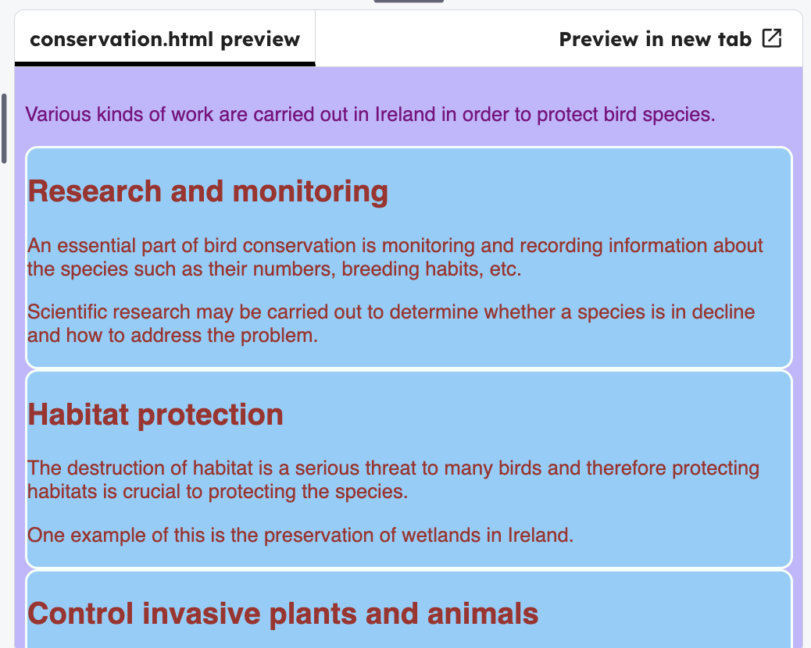

## Create a reusable text box

Make a class that you can reuse to style text boxes on your site.

## Step 1

Click on the `conservation.html` file.

## Step 2

Add the `stylishBox` class to **all** the sections. The first one is shown below.

```html filename="conservation.html" line_numbers="true" line_number_start="28" line_highlights="31"
        Various kinds of work are carried out in Ireland in order to protect bird species.
      </p>

      <section class="stylishBox">
        <h2>Research and monitoring</h2>
        <p>
          An essential part of bird conservation is monitoring and recording
```

## Step 3

Add CSS code so that you have the look you want.

```css filename="styles.css" line_numbers="true" line_number_start="41" line_highlights="45-52"
  border-top-color: #9999ff;
  padding-bottom: 20px;
}

.stylishBox {
  background-color: #87CEFA;
  color: #A52A2A;
  border-style: solid;
  border-width: 2px;
  border-color: #F5FFFA;
  border-radius: 10px;
}
```

## Now run your code

Click **Run** and check that the section has a border with rounded corners.



## Step 4

Experiment with the colours and border settings like `border-radius` until you get the look you want.
