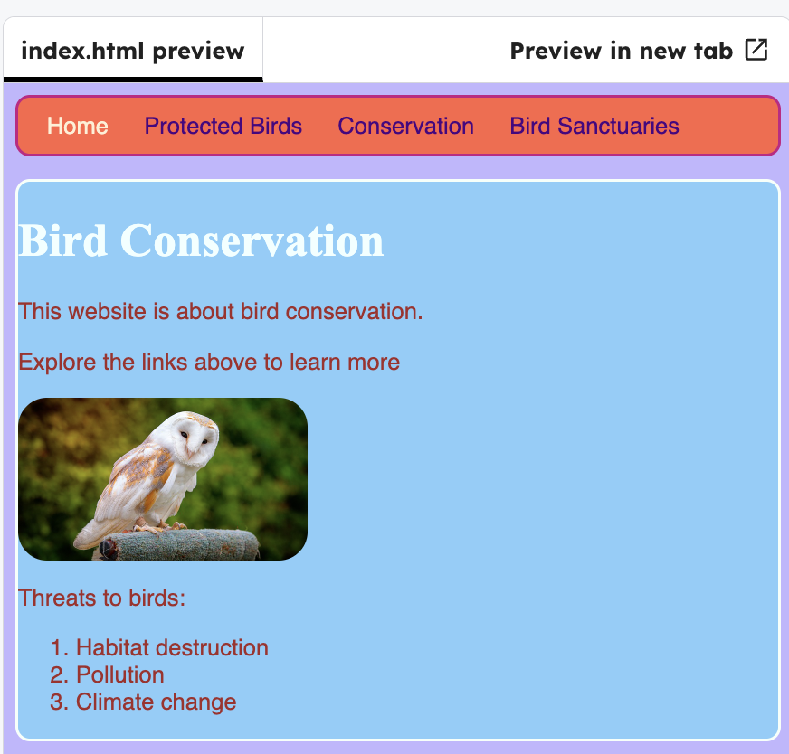

<h2 class="c-project-heading--task">Create a reusable text box</h2>

--- task ---

Make a class that you can reuse to style text boxes in your site.

--- /task ---

--- task ---

Click on the `conservation.index` file.

--- /task ---

--- task ---

Add the `stylishBox` class to all the sections. The first one is shown below.

--- /task ---

--- code ---
---
language: html
filename: conservation.html
line_numbers: true
line_number_start: 22
line_highlights: 24
---
      

        Various kinds of work are carried out in Ireland in order to protect bird species.
      

      <section class="stylishBox">
        <h2>Research and monitoring</h2>
        

          An essential part of bird conservation is monitoring and recording
          information about the species such as their numbers, breeding habits, etc.

        

        

          Scientific research may be carried out to determine whether a species is
          in decline and how to address the problem.
        

      </section>
--- /code ---

--- task ---

Add CSS code so that you have the look you want.

--- /task ---

--- code ---
---
language: css
filename: styles.css
line_numbers: true
line_number_start: 15
line_highlights: 18-23
---
  border-top-color: #9999ff;
  padding-bottom: 20px;
}

.stylishBox {
  background-color: #87CEFA;
  color: #A52A2A;
  border-style: solid;
  border-width: 2px;
  border-color: #F5FFFA;
  border-radius: 10px;
}
--- /code ---

--- task ---

Click **Run** to see the changes. Experiment with the colours, `border-radius` and `padding` until you get the look you want.

--- /task ---

