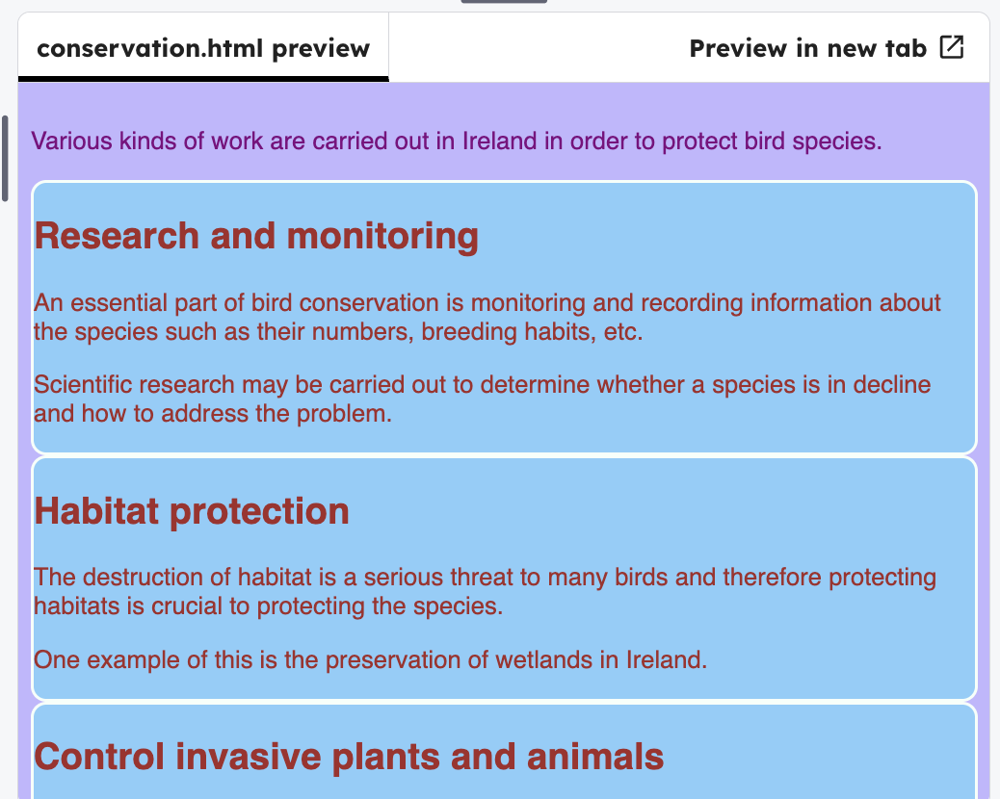

<h2 class="c-project-heading--task">Edit the top divider theme</h2>

--- task ---
Edit `topDivider` class in `styles.css` to go with your design. 
--- /task ---

--- task ---

Change different qualties of the border:
- make it `dotted` or `dashed`
- change the colour and width
- add more or less padding

--- /task ---

--- code ---
---
language: css
filename: styles.css
line_numbers: true
line_number_start: 11
line_highlights: 12-15 
---
.topDivider { 
  border-top-style: dotted;
  border-top-width: 4px;
  border-top-color: #9999ff;
  padding-bottom: 20px;
}
--- /code ---

--- task ---

Click **Run** to see your changes.

--- /task ---

