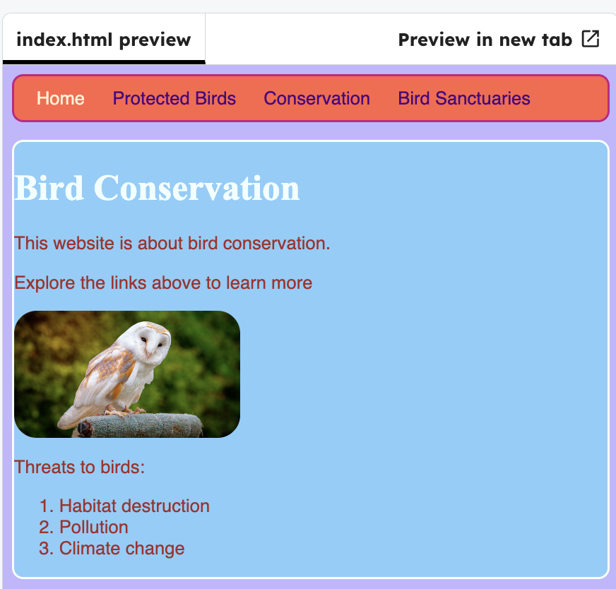

## Reuse the text box

Add the `stylishBox` class to other parts of the website so they are styled too.

## Step 1

Add the `stylishBox` class to the `<main>` of the `index.html` file.

```html filename="index.html" line_numbers="true" line_number_start="19" line_highlights="20"
	</header>
    <main class="stylishBox">
		<section>
			<h1>Bird Conservation</h1>
```

## Now run your code

Click **Run** and check that the parts of the page with the `stylishBox` class now use that style.



## Step 2

Try adding it to other parts of your site.


