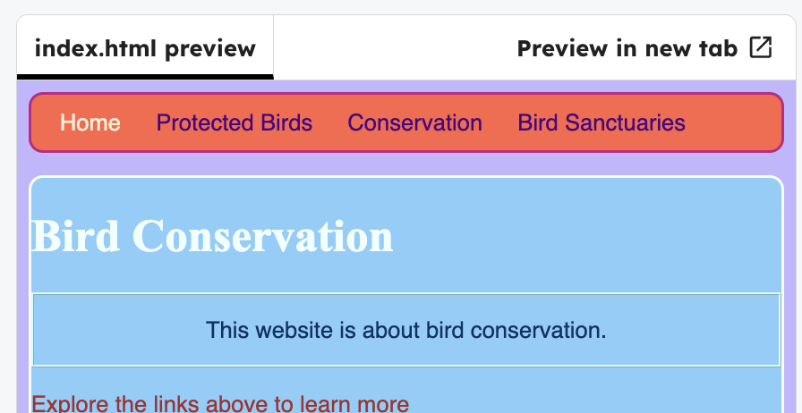

<h2 class="c-project-heading--task">Style paragraph text</h2>

### Step 1

Add the `id` in the `index.html` file.

### Tip

- An ID is used to identify one specific element on a page.
- In HTML, it is written as id="name".
- In CSS, you target it with #name.
- Each ID value should be unique within the page.

--- code ---
---
language: html
filename: index.html
line_numbers: true
line_number_start: 22
line_highlights: 24
---
			<h1>Bird Conservation</h1>

			

				This website is about bird conservation.
			

--- /code ---

### Step 2

In `styles.css`, add a `#myCoolText` selector.

--- code ---
---
language: css
filename: styles.css
line_numbers: true
line_number_start: 50
line_highlights: 54-59
---
  border-color: #F5FFFA;
  border-radius: 10px;
}

#myCoolText { 
  color: #003366;
  border: 2px ridge #ccffff;
  padding: 15px;
  text-align: center;
}
--- /code ---

### Step 3

Click **Run** to see the paragraph has a new style.

