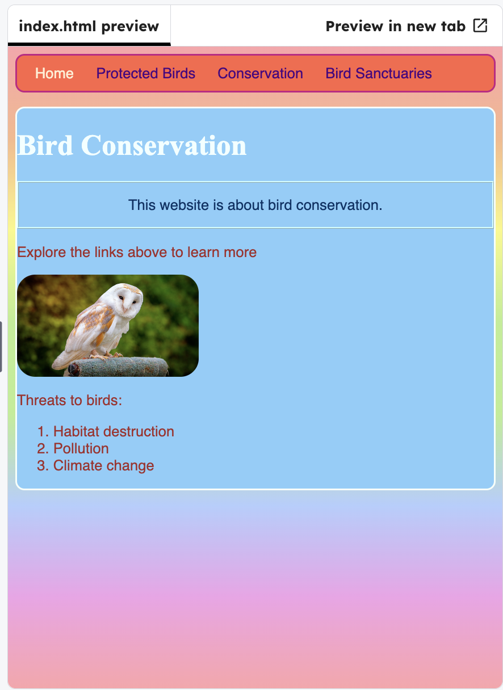

## Give the home page a unique id

In `index.html`, add `id="frontPage"` to the `<body>` tag.

## Step 1

```html filename="index.html" line_numbers="true" line_number_start="7" line_highlights="9"
</head>

<body id="frontPage">
	<header>
		<nav>
```

## Step 2

Then add the block to the CSS.


```css filename="styles.css" line_numbers="true" line_number_start="54" line_highlights="61-64"
#myCoolText { 
  color: #003366;
  border: 2px ridge #ccffff;
  padding: 15px;
  text-align: center;
}

#frontPage {
  background: #48D1CC;
  background: linear-gradient(#fea3aa, #f8b88b, #faf884, #baed91, #baed91, #b2cefe, #f2a2e8, #fea3aa);
}
```

## Now run your code

Click **Run** and check that the front page now has a rainbow-style background.





