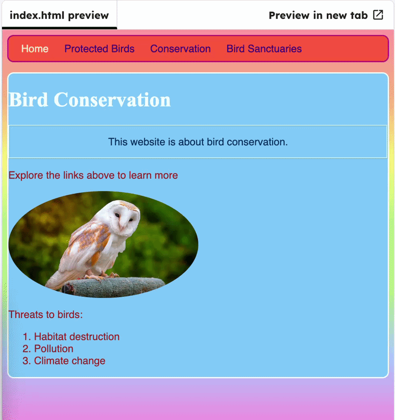

<h2 class="c-project-heading--task">Style the image</h2>

### Step 1

Change the front page image with css.

### Step 2

First, in `index.html` remove the `width` attribute from the barn owl image and give it `id="owly"`.

--- code ---
---
language: html
filename: index.html
line_numbers: true
line_number_start: 29
line_highlights: 31
---
		</section>

		
		
		<section>
--- /code ---

### Step 3

In `styles.css`, add a `#owly` rule that sets its width to `50%` and changes the `border-radius` so it is a round shape.

--- code ---
---
language: css
filename: styles.css
line_numbers: true
line_number_start: 61
line_highlights: 66-70
---
#frontPage {
  background: #48D1CC;
  background: linear-gradient(#fea3aa, #f8b88b, #faf884, #baed91, #baed91, #b2cefe, #f2a2e8, #fea3aa);
}

#owly { 
  width: 50%;
  border-radius: 100%;
}
--- /code ---

### Step 4

Click **Run** to test. Move the output window and see the image change size.

