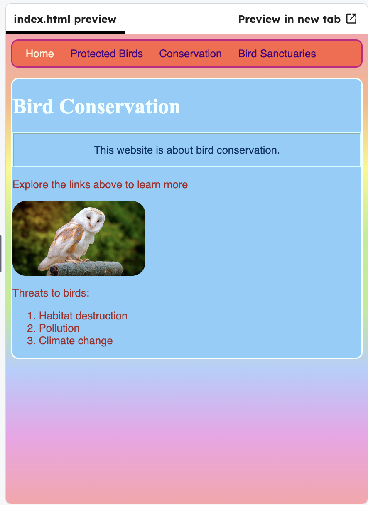

<h2 class="c-project-heading--task">Give the home page a unique id</h2>

--- task ---

In `index.html`, add `id="frontPage"` to the `<body>` tag.

--- /task ---

--- code ---
---
language: html
filename: index.html
line_numbers: true
line_number_start: 7
line_highlights: 9
---
</head>

<body id="frontPage">
	<header>
	  <nav>
--- /code ---

--- task ---

Then add the block to the CSS.

--- /task ---

--- code ---
---
language: css
filename: styles.css
line_numbers: true
line_number_start: 54
line_highlights: 61-64
---
#myCoolText { 
  color: #003366;
  border: 2px ridge #ccffff;
  padding: 15px;
  text-align: center;
}

#frontPage {
  background: #48D1CC;
  background: linear-gradient(#fea3aa, #f8b88b, #faf884, #baed91, #baed91, #b2cefe, #f2a2e8, #fea3aa);
}
--- /code ---

--- task ---

Click **Run** to see the background colour change on the front page.

--- /task ---

