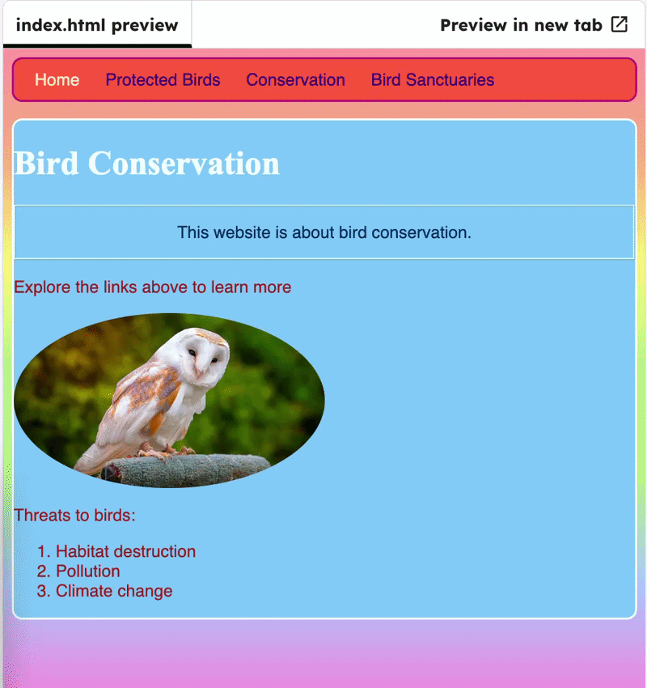

## Animate parts of your site

Create a CSS animation and apply it to an element.

Update `#owly` so it animates, then add a `@keyframes` animation at the end of `styles.css`.

```css filename="styles.css" line_numbers="true" line_number_start="66" line_highlights="69-82"
#owly {
  width: 50%;
  border-radius: 100%;
  animation-name: myFirstAnimation;
  animation-duration: 2s;
  animation-iteration-count: 1;
}

@keyframes myFirstAnimation { /* new animation */
  from {
    width: 100px;
  }
  to {
    width: 300px;
  }
}
```

## Now run your code

Click **Run** and check that the image grows from small to large.


