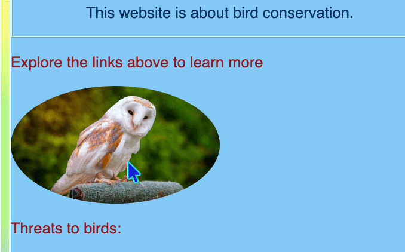

<h2 class="c-project-heading--task">Add hover effects</h2>

### Step 1

Make the website feel interactive by changing styles when the mouse hovers over an element.

### Step 2

Add a border to all images, then add an `img:hover` rule to change the border style.

--- code ---
---
language: css
filename: styles.css
line_numbers: true
line_number_start: 34
line_highlights: 38-40
---
img {
  border-radius: 20px;
}

img:hover { 
  border: 6px dashed Navy;
}

.topDivider { 
--- /code ---

### Step 3

Click **Run** and move your cursor over an image. The border should switch to dashed.

